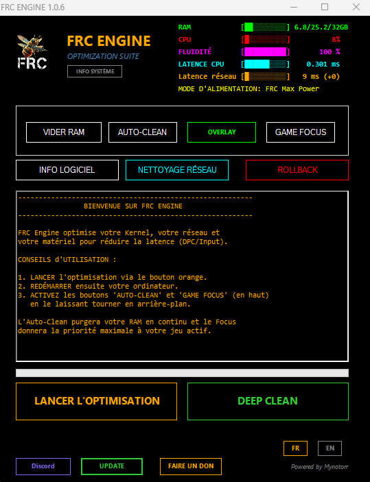

# 🚀 FRC Engine - Optimization Suite (v1.0.6)

**FRC Engine** est une solution d'optimisation de bas niveau (Low-Level) pour Windows, développée pour les joueurs exigeants. Il transforme votre système en une machine de guerre dédiée au gaming en agissant directement sur le Kernel, la gestion des interruptions CPU et la pile réseau.

---

## 📥 TÉLÉCHARGEMENT (DOWNLOAD)

> [!IMPORTANT]
> **Téléchargez la dernière version stable ici :**
> ### ➔ [Lien Direct : FRC_Engine_Package.zip](https://github.com/mynotorr/FRC-Engine-Dist/raw/main/FRC_Engine_Package.zip)

---

## 💎 Nouveautés Majeures - Version 1.0.6

### 🧹 Nettoyage Système (Deep Clean)
* **Nouveau Bouton DEEP CLEAN** : Une solution en un clic pour purger les fichiers inutiles qui encombrent le PC :
    * Suppression des fichiers temporaires utilisateur et système (%TEMP%).
    * Nettoyage du cache de téléchargement **Windows Update** (libère plusieurs Go).
    * Purge des fichiers **Prefetch** obsolètes pour optimiser la réactivité disque.

### 🖥️ Interface de Monitoring Overlay (Widget)
* **Mode Discret** : Un nouveau bouton **OVERLAY** permet de réduire l'interface principale dans la barre des tâches.
* **Couleurs Dynamiques** : L'overlay change de couleur selon la charge CPU (Cyan > Orange > Rouge).
* **Drag & Drop** : Cliquez et glissez l'overlay où vous le souhaitez sur votre écran.
* **Accès Rapide** : Un bouton **MENU PRINCIPAL** permet de restaurer l'interface complète instantanément.

### 🔍 Diagnostic Matériel (System Info)
* **Nouveau Panneau Info Système** : Affiche les spécifications détaillées (CPU, GPU, RAM, BIOS, Stockage) pour vérifier que vos composants sont bien reconnus et optimisés.

### 🎮 Détection de Jeu Intelligente
* Affichage en temps réel du **nom du jeu actif**.
* Visualisation immédiate du statut des modes **[AUTO-CLEAN]** et **[GAME-FOCUS]**.

---

## 🛠️ Spécifications Techniques

### 1. Kernel & Latence (DPC)
* **Win32PrioritySeparation (0x26)** : Priorité maximale aux processus au premier plan.
* **Désactivation HPET & Timers** : Réduction de l'overhead pour une fluidité accrue.
* **System Responsiveness (0%)** : Suppression de la latence imposée par les services Windows.

### 2. Prometheus Network Engine v2
* **Nagle Algorithm Off** : Envoi immédiat des paquets pour un ping minimal.
* **NetDMA & RSS** : Distribution de la charge réseau sur tous les cœurs CPU.
* **TCP Autotuning** : Stabilisation du flux de données pour éliminer le Jitter.

### 3. Gestion de la RAM & CPU
* **API EmptyWorkingSet** : Purge de la mémoire vive sans impact sur les performances.
* **Game Focus** : Forçage de la priorité CPU "Haute" sur votre jeu pour éviter les chutes d'FPS.

---

## 📋 Manuel d'Utilisation

1. **Privilèges** : Exécutez impérativement `FRC_Engine.exe` en tant qu'**Administrateur**.
2. **Initialisation** : Cliquez sur **LANCER L'OPTIMISATION** (38 étapes critiques).
3. **Validation** : Redémarrez votre PC pour valider les changements Kernel/Registre.
4. **En Jeu** : Activez **AUTO-CLEAN** et **GAME FOCUS**, puis passez en mode **OVERLAY**.

---

## 📝 Changelog v1.0.5
- Bouton DEEP CLEAN pour un nettoyage complet (Temp, Windows Update, Prefetch).
- Ajout de l'overlay dynamique et déplaçable.
- Nouveau bouton de retour au menu principal.
- Intégration de l'outil "System Info" pour le diagnostic matériel.
- Optimisation de la détection de processus (Focus Engine).
- Correction du rafraîchissement des données réseau.
- Optimisation des calculs de latence Kernel.

---

## 🤝 Support & Communauté

* **Discord** : [Rejoindre le serveur](https://discord.gg/eRR4adQ4Wv)
* **Donations** : Soutenez le projet via [PayPal](https://www.paypal.com/ncp/payment/H52TKW7E6PV2S)

---
*Développé par **Mynotorr**. Utilisez à vos propres risques. Destiné aux systèmes Windows 10/11.*
